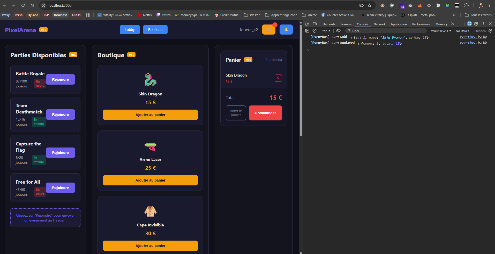
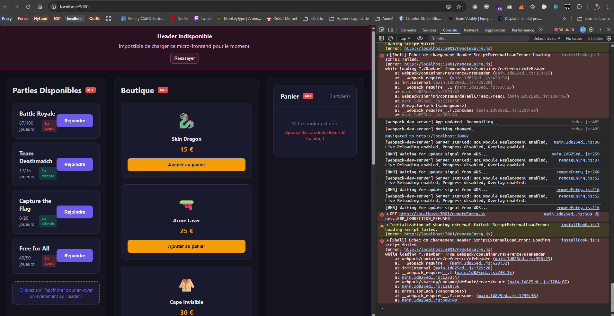
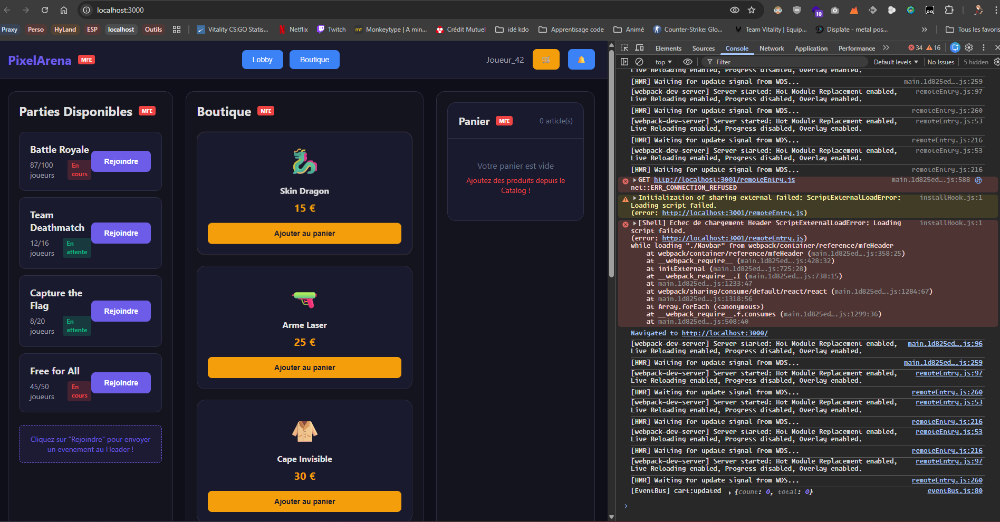
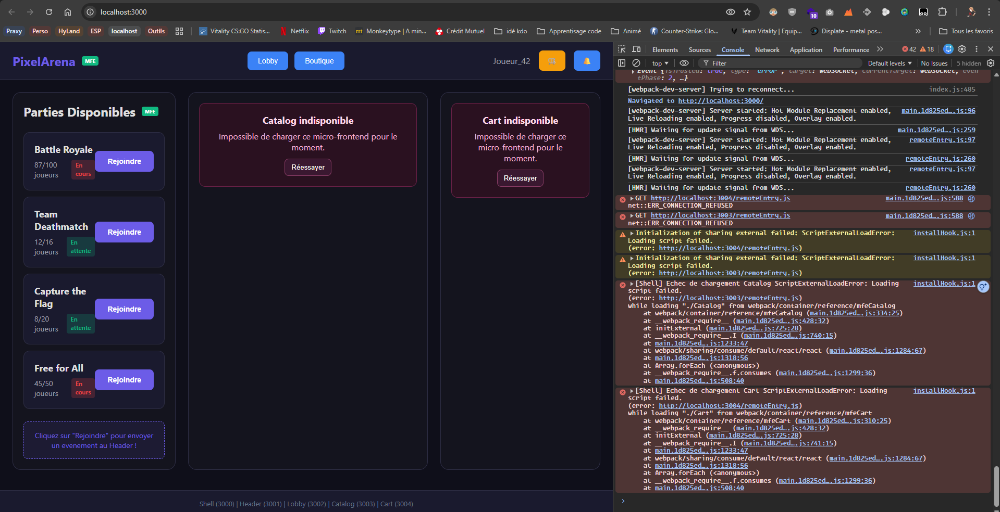

# CP9 — La Résilience

> ⏱ 15 min — Compétences couvertes : C3, C14

Télécharge le zip **checkpoint9** depuis Teams.

---

## Lancer (5 terminaux)

```bash
T1 : cd mfe-header  && npm install && npm start   # 3001
T2 : cd mfe-lobby   && npm install && npm start   # 3002
T3 : cd mfe-catalog && npm install && npm start   # 3003
T4 : cd mfe-cart    && npm install && npm start   # 3004
T5 : cd shell       && npm install && npm start   # 3000
```

---

## Mission

Tout fonctionne. Maintenant **tue des services** et observe.


**Étape 1** : Dans le terminal du Lobby (T2), appuie sur `Ctrl+C`
→ Observe `localhost:3000`. Que se passe-t-il ?


**Étape 2** : Relance le Lobby (`npm start`)
→ Il revient sans redémarrer les autres.


**Étape 3** : Tue le Catalog (T3), puis le Cart (T4)
→ Les autres MFEs restent-ils affectés ?


**Étape 4** : Prépare ta réponse — pourquoi un MFE cassé n'arrête pas les autres ?
Parcequ'il est capable de gérer les erreurs avec des fallback. Les MFE manquants ne sont que des services. Tels une api qui ne réponds plus, ça ne casse pas l'application front par exemple.

---

## Validation

Tu peux expliquer pourquoi un MFE qui crash n'arrête pas les autres.

---

📤 Push ta branche
